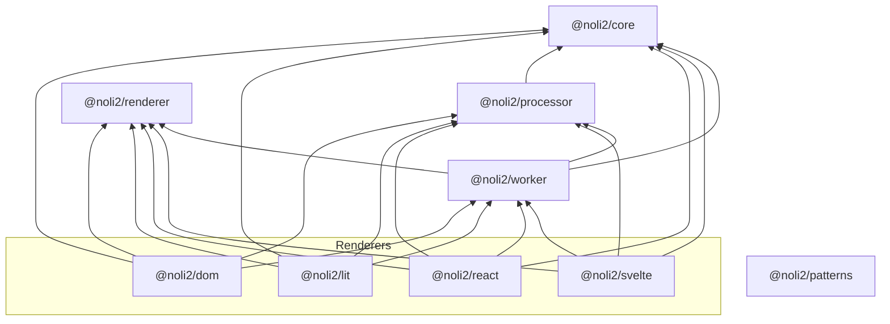

# NoLi NoLi

[](https://opensource.org/licenses/MIT)

<div align="center">

</div>

## Install 
```shell copy
npm i @noli2/react
```

## Features / Loadmap
<div>
<input type="checkbox" checked style="accent-color: #64f0b4;transform: scale(1.25)">
aaa
</div>
<div>
<input type="checkbox" checked style="accent-color: #64f0b4;transform: scale(1.25)">
bbb
</div>
<div>
<input type="checkbox" checked style="accent-color: #64f0b4;transform: scale(1.25)">
aaa
</div>
<div>
<input type="checkbox" checked style="accent-color: #64f0b4;transform: scale(1.25)">
bbb
</div>
<div>
<input type="checkbox" checked style="accent-color: #64f0b4;transform: scale(1.25)">
aaa
</div>
<div>
<input type="checkbox" checked style="accent-color: #64f0b4;transform: scale(1.25)">
bbb
</div>

## Usage

オプションは設けていませんが、背景にライフゲームを表示させるのは容易いことです。styleにdisplay:absolute; inset:0;z-index: -1;opacity: 50を指定するだけです。

### カスタムレンダラー
いちいちcoreをインストールしなくていいように、ヘルパー関数を用意している。

## Dependencies


## Naming
"NO GAME NO LIFE" -> No LifeGame No Life -> NoLiNoli -> noli2
好きに呼べばいいですが、開発者は「ノラノラ」と呼びます。